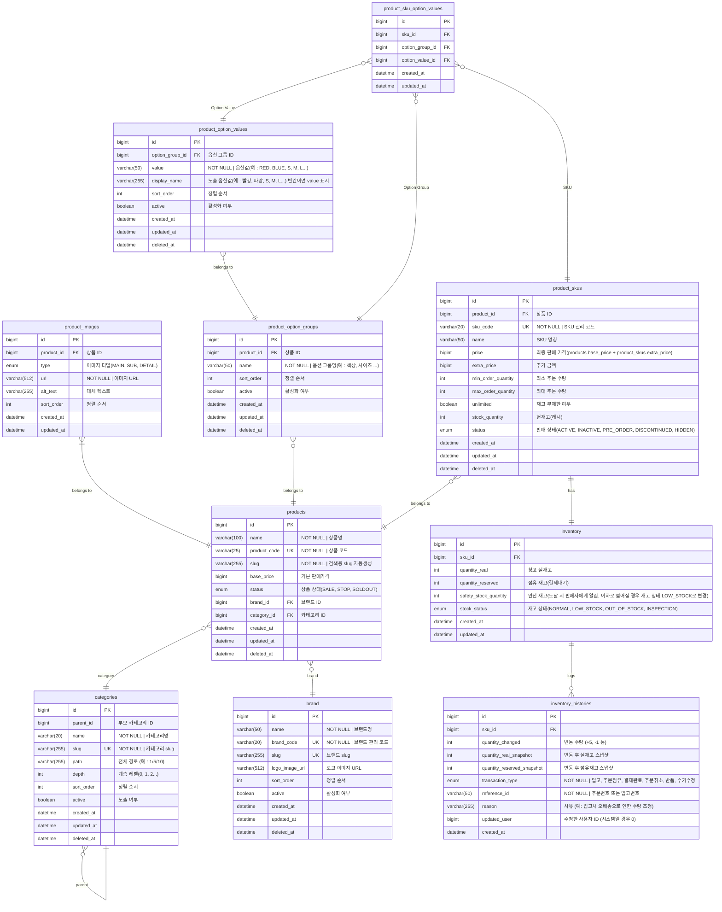

```mermaid
erDiagram
  products {
    bigint id PK
    varchar(100) name "NOT NULL | 상품명"
    varchar(25) product_code UK "NOT NULL | 상품 코드"
    varchar(255) slug "NOT NULL | 검색용 slug 자동생성"
    bigint base_price "기본 판매가격"
    enum status "상품 상태(SALE, STOP, SOLDOUT)"
    bigint brand_id FK "브랜드 ID"
    bigint category_id FK "카테고리 ID"
    datetime created_at
    datetime updated_at
    datetime deleted_at
  }

  product_images {
    bigint id PK
    bigint product_id FK "상품 ID"
    enum type "이미지 타입(MAIN, SUB, DETAIL)"
    varchar(512) url "NOT NULL | 이미지 URL"
    varchar(255) alt_text "대체 텍스트"
    int sort_order "정렬 순서"
    datetime created_at
    datetime updated_at
  }

  categories {
    bigint id PK
    bigint parent_id "부모 카테고리 ID"
    varchar(20) name "NOT NULL | 카테고리명"
    varchar(255) slug UK "NOT NULL | 카테고리 slug"
    varchar(255) path "전체 경로 (예 : 1/5/10)"
    int depth "계층 레벨(0, 1, 2...)"
    int sort_order "정렬 순서"
    boolean active "노출 여부"
    datetime created_at
    datetime updated_at
    datetime deleted_at
  }

  product_option_groups {
    bigint id PK
    bigint product_id FK "상품 ID"
    varchar(50) name "NOT NULL | 옵션 그룹명(예 : 색상, 사이즈 ...)"
    int sort_order "정렬 순서"
    boolean active "활성화 여부"
    datetime created_at
    datetime updated_at
    datetime deleted_at
  }

  product_option_values {
    bigint id PK
    bigint option_group_id FK "옵션 그룹 ID"
    varchar(50) value "NOT NULL | 옵션값(예 : RED, BLUE, S, M, L...)"
    varchar(255) display_name "노출 옵션값(예 : 빨강, 파랑, S, M, L...) 빈칸이면 value 표시"
    int sort_order "정렬 순서"
    boolean active "활성화 여부"
    datetime created_at
    datetime updated_at
    datetime deleted_at
  }

  product_skus {
    bigint id PK
    bigint product_id FK "상품 ID"
    varchar(20) sku_code UK "NOT NULL | SKU 관리 코드"
    varchar(50) name "SKU 명칭"
    bigint price "최종 판매 가격(products.base_price + product_skus.extra_price)"
    bigint extra_price "추가 금액"
    int min_order_quantity "최소 주문 수량"
    int max_order_quantity "최대 주문 수량"
    boolean unlimited "재고 무제한 여부"
    int stock_quantity "현재고(캐시)"
    enum status "판매 상태(ACTIVE, INACTIVE, PRE_ORDER, DISCONTINUED, HIDDEN)"
    datetime created_at
    datetime updated_at
    datetime deleted_at
  }

  product_sku_option_values {
    bigint id PK
    bigint sku_id FK
    bigint option_group_id FK
    bigint option_value_id FK
    datetime created_at
    datetime updated_at
  }

  brand {
    bigint id PK
    varchar(50) name "NOT NULL | 브랜드명"
    varchar(20) brand_code UK "NOT NULL | 브랜드 관리 코드"
    varchar(255) slug UK "브랜드 slug"
    varchar(512) logo_image_url "로고 이미지 URL"
    int sort_order "정렬 순서"
    boolean active "활성화 여부"
    datetime created_at
    datetime updated_at
    datetime deleted_at
  }

  inventory {
    bigint id PK
    bigint sku_id FK
    int quantity_real "창고 실재고"
    int quantity_reserved "점유 재고(결제대기)"
    int safety_stock_quantity "안전 재고(도달 시 판매자에게 알림, 이하로 떨어질 경우 재고 상태 LOW_STOCK로 변경)"
    enum stock_status "재고 상태(NORMAL, LOW_STOCK, OUT_OF_STOCK, INSPECTION)"
    datetime created_at
    datetime updated_at
  }

  inventory_histories {
    bigint id PK
    bigint sku_id FK
    int quantity_changed "변동 수량 (+5, -1 등)"
    int quantity_real_snapshot "변동 후 실재고 스냅샷"
    int quantity_reserved_snapshot "변동 후 점유재고 스냅샷"
    enum transaction_type "NOT NULL | 입고, 주문점유, 결제완료, 주문취소, 반품, 수기수정"
    varchar(50) reference_id "NOT NULL | 주문번호 또는 입고번호"
    varchar(255) reason "사유 (예: 입고처 오배송으로 인한 수량 조정)"
    bigint updated_user "수정한 사용자 ID (시스템일 경우 0)"
    datetime created_at
  }


  product_images }|--|| products : "belongs to"
  product_option_groups }o--|| products : "belongs to"
  product_option_values }|--|| product_option_groups : "belongs to"
  product_skus }o--|| products : "belongs to"
  product_sku_option_values }o--|| product_skus : "SKU"
  product_sku_option_values }o--|| product_option_groups : "Option Group"
  product_sku_option_values }o--|| product_option_values : "Option Value"
  products }o--|| brand : "brand"
  products }o--|| categories : "category"
  categories }o--|| categories : "parent"
  product_skus ||--|| inventory : "has"
  inventory ||--o{ inventory_histories : "logs"
```